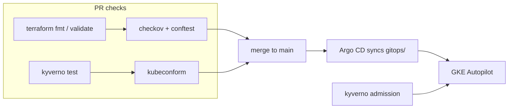

# gke-platform

A GKE platform blueprint I run on my own GCP project: Terraform for the infrastructure, Argo CD for workloads, and policy as code enforced twice — in the pipeline before anything exists, and at admission once the cluster is live.



## Layout

| Path | Contents |
|------|----------|
| `terraform/modules/` | network (VPC, NAT, firewall baseline), gke (Autopilot, private nodes), github-wif (keyless deploys) |
| `terraform/envs/dev/` | The one live environment |
| `policy/terraform/` | Conftest rules with their own unit tests (`conftest verify`) |
| `policy/cluster/` | Kyverno policies plus `kyverno test` fixtures |
| `gitops/` | Argo CD app-of-apps, kustomize overlays, monitoring stack |
| `services/hello-api/` | Spring Boot demo workload |

## How CI works

No GCP credentials anywhere in CI. Every check is static: checkov and conftest read the HCL, kyverno runs against test fixtures and the rendered kustomize output, kubeconform validates schemas. A pull request from a fork cannot touch the infrastructure, and CI stays green while the cluster is destroyed. The reasoning for this and other choices is in [DECISIONS.md](DECISIONS.md).

Deploys authenticate through Workload Identity Federation with an `attribute_condition` pinned to this repository. There is a conftest rule that fails the build if that condition ever disappears, because without it any GitHub repo can impersonate the deployer.

## Local demo, no GCP needed

The whole platform runs on a local kind cluster: Kyverno enforcing the same policies, Argo CD syncing this repo from GitHub, hello-api built from source.

```bash
make local        # creates the cluster, installs everything, bootstraps Argo CD
make local-down   # deletes it
```

The script prints how to reach the Argo CD UI and the service. Try deploying a pod with no resource requests to watch Kyverno reject it.

Monitoring comes up with the rest: kube-prometheus-stack managed by Argo CD, hello-api scraped through a ServiceMonitor, a golden-signals dashboard provisioned from a ConfigMap that lives next to the service, and three alerts checked with promtool in CI. Grafana:

```bash
kubectl -n monitoring port-forward svc/monitoring-grafana 3000:80
# user admin, password:
kubectl -n monitoring get secret monitoring-grafana -o jsonpath='{.data.admin-password}' | base64 -d
```

## Running it on GCP

```bash
make validate policy test    # everything CI runs, locally

cd terraform/envs/dev
cp terraform.tfvars.example terraform.tfvars   # set project_id and your IP
terraform init && terraform apply

# once the cluster exists
kubectl apply -k https://github.com/argoproj/argo-cd/manifests/cluster-install?ref=stable -n argocd
kubectl apply -f gitops/argocd/root-app.yaml
```

`terraform destroy` tears the whole thing down; I don't keep the cluster running between sessions.

## Next

- Preview environments per PR via an Argo CD ApplicationSet
- Image build and push to Artifact Registry from CI on tags
